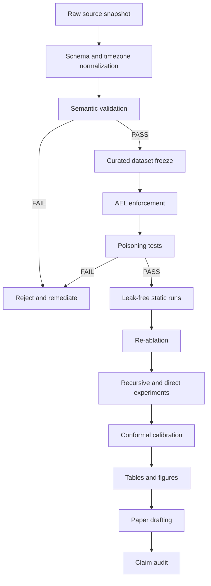
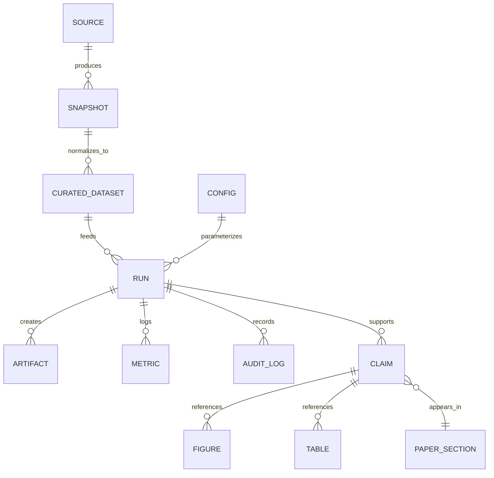

# Οργάνωση και λειτουργία του GR Energy Forecast Trading Agent μέσα στο Claude

## Εκτελεστική σύνοψη

Η πιο αποδοτική αρχιτεκτονική για το project σας δεν είναι «όλα μέσα στο chat», αλλά ένα τριεπίπεδο λειτουργικό μοντέλο: **Claude Code για repository-aware εργασία και CI**, **remote connectors για cloud υπηρεσίες** όπως Drive και GitHub, και **τοπικά ή custom MCP servers για data-plane πρόσβαση** σε SQL/S3/BigQuery όταν χρειάζεστε ελεγχόμενα εργαλεία και auditability. Οι επίσημες οδηγίες της Anthropic κάνουν σαφή διάκριση ανάμεσα σε remote connectors που δουλεύουν σε όλα τα surfaces και desktop/local extensions που δουλεύουν μόνο σε Claude Desktop και Claude Code· επίσης τονίζουν ότι οι remote custom connectors δρομολογούνται από την υποδομή της Anthropic και όχι από το laptop σας, άρα ιδιωτικά δίκτυα, VPN-only endpoints και internal DBs θέλουν ειδική αρχιτεκτονική πρόσβασης. citeturn19view0turn18view0turn16view1turn16view0

Με βάση το υλικό που ανέβασες, το project **δεν είναι πια σε “debug-and-repair” phase**, αλλά σε **controlled re-baselining phase**: το AEL έχει ήδη υλοποιηθεί, τα βασικά timezone guards περνούν, τα cross-actuals poisoning tests περνούν, και το επόμενο επιστημονικά σωστό βήμα είναι leak-free static runs, μετά re-ablation, μετά recursive/direct, μετά conformal, και μόνο τότε νέο headline result. Αυτό σημαίνει ότι στο Claude η σωστή οργάνωση πρέπει να χτιστεί γύρω από **gates**, όχι γύρω από «έξυπνα prompts». fileciteturn0file4

Η κεντρική σύσταση είναι η εξής: κράτα **τον σκληρό έλεγχο εγκυρότητας έξω από το prompt layer**. Τα docs της Anthropic είναι απολύτως σαφή ότι το `CLAUDE.md` και οι μνήμες είναι guidance, όχι enforcement· αν ένας κανόνας πρέπει να ισχύει πάντα, χρειάζεται hook, settings/policy, CI gate ή deterministic script. Αυτό ταιριάζει απόλυτα με το scientific contract του project σας: AEL/freeze, timezone contract, poisoning tests, reproducibility anchor, ίδια windows για συγκρίσεις και explicit provenance πρέπει να ζουν σε κώδικα και checks, ενώ το Claude να οργανώνει, να εκτελεί και να τεκμηριώνει αυτή τη ροή. citeturn5view0turn6view3turn8view1

Ως προς τα forecasting μοντέλα, η βιβλιογραφία και το δικό σας state δείχνουν ότι **LGBM και XGB** παραμένουν οι σωστές κύριες γραμμές ως leak-free baseline families, με **static / recursive / direct** ως διακριτά experimental regimes και ensembles μόνο μετά από καθαρό out-of-sample weighting. Η πρόσφατη εργασία για Greece/Belgium/Ireland με short windows βρήκε ότι το LightGBM ήταν το πιο σταθερό από τα εξεταζόμενα μοντέλα, ενώ η ευρύτερη EPF βιβλιογραφία τονίζει ότι οι συγκρίσεις πρέπει να είναι αυστηρά benchmarked σε κοινά windows και με δημόσια, επαναλήψιμη αξιολόγηση. citeturn48academia4turn48academia3

Τέλος, για να γίνει το project **academic-paper–ready**, χρειάζεται να αντιμετωπίζεται κάθε Claude session σαν μέρος ενός reproducible research system: κάθε run με manifest, κάθε figure με source JSON/CSV, κάθε claim με command+artifact trail, κάθε αλλαγή σε data semantics με preflight+control run, και κάθε paper paragraph να συνδέεται σε reproducible outputs. Αυτό είναι ακριβώς το είδος ιχνηλασιμότητας που ζητά και η σύγχρονη συζήτηση για leakage και reproducibility στη ML έρευνα. citeturn47academia0turn47academia1turn47academia3

## Πού βρίσκεστε τώρα και τι σημαίνει οργανωτικά

Το πιο σημαντικό operational fact είναι ότι το repository σας έχει ήδη έναν **επιστημονικό πυρήνα εγκυρότητας** που δεν πρέπει να ξανασχεδιαστεί στο Claude, αλλά να «ανεβεί» ως canonical policy μέσα στο Claude Code. Στο checklist που ανέβασες, αναφέρεται ότι: το AEL είναι υλοποιημένο με freeze-at-cutoff, οι same-day/same-auction πηγές είναι εκτός parquet, τα poisoning tests για cross-actuals περνούν, τα timezone guards περνούν, και υπάρχει σαφής ακολουθία επόμενων gates: leak-free static Q1 runs, μετά re-ablation, μετά cadence/seed confirmation, μετά probabilistic layer. fileciteturn0file4

Άρα το σωστό organizational abstraction είναι να χωρίσεις όλη τη δουλειά σε τέσσερα states:

| State | Τι σημαίνει | Τι επιτρέπεται να κάνει το Claude | Τι **δεν** επιτρέπεται να κάνει |
|---|---|---|---|
| `policy-hardening` | TZ, AEL, poisoning, provenance rules | Να ελέγχει hooks, manifests, configs, CI, docs | Να «υποθέτει» εγκυρότητα από prompts |
| `baseline-regeneration` | Πρώτα leak-free static και control reruns | Να εκτελεί deterministic pipelines και να γράφει reports | Να συγκρίνει παλιά leaky νούμερα με νέα clean νούμερα |
| `comparative-experiments` | re-ablation, recursive/direct, cadence, seeds | Να orchestrate batch runs, summaries, figure drafts | Να βγάζει headline claims από 1 seed / 1 window |
| `paperization` | conformal, figures, tables, manuscript | Να συνθέτει sections, appendices, references, audit links | Να «καθαρίζει» ασάφειες με hand-wavy prose |

Αυτό το state machine είναι συνεπές με το δικό σου checklist και με τις βέλτιστες πρακτικές της Claude Code για context isolation, checkpoints, subagents και reproducible workflows. Το Claude Code έχει σχεδιαστεί ώστε extensions όπως Skills, subagents, hooks και MCP να μπαίνουν σε διαφορετικά σημεία του agentic loop· αυτό σε βοηθά να κρατήσεις το policy layer, το execution layer και το synthesis layer καθαρά διαχωρισμένα. fileciteturn0file4 citeturn5view0turn36view1turn36view3turn36view4

Η πιο κρίσιμη οργανωτική απόφαση είναι να θεωρήσεις τις παρακάτω αρχές ως **non-negotiable invariants**:

1. **Το `CLAUDE.md` δεν είναι enforcement layer.** Είναι persistent guidance. Για κανόνες όπως “μην τρέξεις write-capable connectors στη Research”, “μην γράψεις result χωρίς manifest”, “μην κάνεις compare windows ανομοιόμορφα”, θέλεις hooks, permissions και CI gates. citeturn6view3turn5view0turn8view1  
2. **Το chat δεν είναι tracker.** Ο tracker είναι manifest table + JSON artifacts + git history + CI logs. Το Claude απλώς τα συντονίζει και τα αναλύει. citeturn29view3turn29view1turn12view0  
3. **Το context window είναι scarce resource.** Μεγάλα investigations, schema audits και source comparisons πρέπει να πηγαίνουν σε subagents, ώστε το main session να μένει καθαρό για decisions και synthesis. citeturn36view1turn36view3turn8view4  
4. **Research mode και connectors θέλουν προσοχή.** Η Anthropic σημειώνει ότι το Research μπορεί να καλέσει connector tools αυτόματα, χωρίς περαιτέρω approval, και συστήνει να απενεργοποιούνται write tools όταν γίνεται research. Για δικό σας project αυτό σημαίνει: read-only research connectors, write-capable tools μόνο σε explicit operator sessions. citeturn18view0

## Το προτεινόμενο λειτουργικό μοντέλο μέσα στο Claude

### Επιλογή surface ανά εργασία

Για το GR Energy Forecast / Trading Agent, δεν υπάρχει ένα μόνο «σωστό Claude». Χρειάζεσαι συγκεκριμένο surface για κάθε κατηγορία εργασίας. Τα επίσημα docs λένε ότι οι remote connectors δουλεύουν σε όλα τα Claude surfaces, ενώ οι desktop extensions είναι τοπικές και διαθέσιμες μόνο σε Claude Desktop και Claude Code. Το Claude Code, επιπλέον, προσφέρει Skills, hooks, subagents, permission modes και GitHub Actions integration, άρα είναι το σωστό execution cockpit για το repo. citeturn19view0turn19view1turn5view0turn29view3

| Εργασία | Claude skills/connectors | Τοπικά scripts | Άλλα LLMs |
|---|---|---|---|
| Επιστημονικοί κανόνες, workflow memory, conventions | **Ιδανικό** με `CLAUDE.md` + Skills + hooks. Καλό για reusable process knowledge, όχι για hard enforcement. citeturn7view0turn6view3turn8view1 | Πολύ καλό για deterministic enforcement, αλλά φτωχότερο σε explanation/synthesis | Gemini CLI και Codex CLI έχουν ισχυρό terminal story, αλλά το Claude Code δίνει πολύ ώριμο συνδυασμό Skills/hooks/subagents/workflow memory. citeturn34view0turn35view0 |
| Data ingestion από cloud systems | Καλό όταν το source είναι SaaS/publicly reachable remote MCP server | Άριστο για deterministic ETL και retries | Gemini CLI είναι extensible με MCP· Codex CLI είναι local coding agent, αλλά η operational ωριμότητα του Claude γύρω από connectors είναι πιο άμεσα τεκμηριωμένη για αυτό το use case. citeturn17view0turn18view0turn34view0turn35view0 |
| SQL/S3/BigQuery με scientific reproducibility | Χρήσιμο ως controlled interface, αλλά θέλει δικό σας MCP adapter και αυστηρά tool permissions | **Προτιμητέο** για production ETL, schema checks και snapshots | Άλλα agents βοηθούν, αλλά πάλι οι deterministic scripts είναι η πηγή αλήθειας |
| AEL / freeze / poisoning / TZ guards | **Όχι μόνο prompt**· καλύτερα hooks + script invocations + CI gates | **Υποχρεωτικό** για πραγματικό enforcement | Ίδιο συμπέρασμα και για άλλα LLMs |
| Batch experiments / ablations | Καλό για orchestration, manifests, summaries, job generation | **Υποχρεωτικό** για training/eval determinism | Όλα μπορούν να βοηθήσουν· ο differentiator είναι πόσο καλά δένουν με το repo |
| Paper drafting / figures / tables | **Πολύ καλό** με Skills, Artifacts και citation-aware writing | Μόνο βοηθητικά | Άλλα LLMs είναι επίσης χρήσιμα, αλλά το Claude προσφέρει πολύ φυσικό pattern με Skills + Artifacts + connectors for sources. citeturn23view0turn5view0 |
| Code review / CI comments | Claude Code GitHub Actions είναι from-first-party και τρέχει σε GitHub runners | Συμπληρωματικά checks | Codex/Gemini έχουν επίσης ισχυρά coding agents, αλλά εδώ η native Anthropic τεκμηρίωση είναι πιο άμεσα αξιοποιήσιμη για Claude workflows. citeturn29view3turn35view0turn34view0 |

Η συνιστώμενη χαρτογράφηση connectors είναι η εξής:

| Πηγή | Συνιστώμενος τύπος σύνδεσης | Γιατί |
|---|---|---|
| Google Drive | Remote connector / remote MCP | Είναι cloud/SaaS asset· θέλεις availability παντού και per-user permissions inheritance. citeturn19view0turn19view1 |
| GitHub | Remote connector για reading/issues/PR context, Claude Code GitHub Action για CI | Native fit με repo workflows και PR review automation. citeturn29view3turn15view0 |
| S3 | Custom remote MCP αν το bucket είναι προσβάσιμο με ασφαλή δημόσια endpoint ή proxy· αλλιώς local/private adapter | Οι remote custom connectors χρειάζονται public reachability από Anthropic infra. citeturn18view0turn17view0 |
| BigQuery | Custom remote MCP server με read-only analytical tools | Καλό για queryable experiment warehouse· όχι για raw execution logic μέσα στο prompt. citeturn17view0turn22view0 |
| SQL localhost / internal DB | Desktop extension ή local MCP / direct scripts | Τα local tools ταιριάζουν καλύτερα σε localhost και OS-level πρόσβαση. citeturn19view0turn16view0 |

### Το policy stack που προτείνω

Για να είναι το project auditable, το policy stack πρέπει να είναι τριπλό:

```text
Layer A: Human-readable policy
- CLAUDE.md
- /skills/*
- paper-side runbooks

Layer B: Hard enforcement
- PreToolUse / PostToolUse hooks
- permissions / tool access
- CI required checks

Layer C: Scientific truth
- Python scripts
- manifests
- JSON/CSV artifacts
- git commit + run_id + seed
```

Αυτό ακολουθεί ακριβώς το πνεύμα των docs: τα hooks είναι deterministic και μπορούν να μπλοκάρουν unsafe actions, ενώ τα Skills είναι prompt-native reusable workflows και τα subagents είναι ιδανικά για απομόνωση μεγάλων ερευνών ή validation passes. citeturn5view0turn7view3turn7view0turn8view4

### Permission modes και operational discipline

Το Claude Code υποστηρίζει `default/manual`, `acceptEdits`, `plan`, `auto`, `dontAsk` και `bypassPermissions`. Για το project σου η λογική πρέπει να είναι:

- `plan` για refactors, state transitions, pipeline design.
- `default/manual` όταν αγγίζεις data semantics, manifests, results.
- `dontAsk` μόνο σε CI jobs με strict allowlist tools.
- `auto` μόνο σε sandboxed, non-destructive worktrees.
- **ποτέ** `bypassPermissions` στο κύριο research environment. citeturn8view0turn6view2

Πρακτικά, προτείνω η default στάση να είναι: **plan → apply in worktree → run gates → summarize**. Η Anthropic προτείνει επιθετική διαχείριση context και χρήση subagents/checkpoints· αυτό ταιριάζει πολύ με research codebases όπου το “ένα chat για όλα” γεμίζει γρήγορα και αλλοιώνει την ποιότητα. citeturn36view1turn36view2turn36view3turn36view4

## Αναλυτικό επιχειρησιακό πλάνο και βήμα προς βήμα pipelines

### Pipeline για data ingestion

Ο στόχος εδώ είναι ένα **διφασικό ingestion**: πρώτα deterministic fetch/snapshot, μετά semantic validation. Το Claude δεν πρέπει να γράφει απευθείας στα canonical datasets χωρίς manifest και source snapshot. Αυτό είναι συνεπές με το δικό σας invariant ότι κάθε νέα πηγή περνά πρώτα από pre-flight πρωτόκολλο διαθεσιμότητας/lag/hour-profile. fileciteturn0file4

**Βήματα**

1. **Source declaration**  
   Δηλώνεις στο `sources.yaml` το source, publication clock, timezone, delivery granularity, retention, connector mode, read/write capability, και expected availability lag.

2. **Raw snapshot fetch**  
   Εκτελείς deterministic fetch μέσω script, όχι μέσω ad-hoc prompt. Για cloud SaaS μπορείς να έχεις Claude-triggered connector call, αλλά το write path παραμένει script-driven.

3. **Immutable landing**  
   Αποθηκεύεις raw payload σε `data/raw/<source>/<snapshot_date>/...` μαζί με checksum, request metadata, response headers, connector/tool id.

4. **Normalization pass**  
   Μετατροπή σε canonical schema, χωρίς leakage-sensitive joins.

5. **Semantic validation**  
   Checks για missingness, hour count, DST anomalies, schema drift, monotonic times, duplicate keys, publication lag alignment.

6. **Promotion**  
   Μόνο αν περάσουν όλα τα checks, γράφεις σε `parquet/curated/`.

**Παράδειγμα command**

```bash
python scripts/ingest_source.py \
  --source entsoe_load_fc \
  --asof 2026-03-31T12:00:00+03:00 \
  --snapshot-id 20260331T120000_EET \
  --write-manifest
```

**Ελάχιστο manifest ingestion**

```json
{
  "snapshot_id": "20260331T120000_EET",
  "source": "entsoe_load_fc",
  "retrieval_mode": "script",
  "connector": "none",
  "requested_at": "2026-03-31T12:00:00+03:00",
  "source_timezone": "UTC",
  "canonical_timezone": "CET/CEST-naive",
  "raw_checksum_sha256": "…",
  "row_count_raw": 1824,
  "row_count_curated": 1824,
  "schema_version": "v3",
  "passed_semantic_checks": true
}
```

Η χρήση connector εδώ είναι χρήσιμη μόνο για γρήγορη αναζήτηση/επισκόπηση. Για reproducible fetching, ο deterministic script πρέπει να παραμένει canonical, ειδικά για BigQuery/S3/SQL όπου θέλεις stable query text, pinned credentials scope και σαφές audit trail. Οι remote connectors είναι καλύτεροι για cloud services, ενώ local/desktop extensions για localhost ή OS-level assets. citeturn19view0turn18view0turn16view0turn17view0

### Pipeline για timezone-fix validation

Το checklist σου δείχνει ότι ο timezone contract πρέπει να είναι **μοναδικός και συγκεντρωμένος στο data layer**, ότι τα solar checks ήδη περνούν, και ότι υπάρχει εκκρεμότητα στο `fetch_weather_2026.py` επειδή ζητά UTC ενώ το parquet είναι UTC+1 / CET-CEST naive frame. Άρα εδώ δεν χρειάζεται “νέα ιδέα”, αλλά τυποποίηση και κλείδωμα. fileciteturn0file4

**Βήματα**

1. Κάθε fetcher να δηλώνει ρητά `source_clock`, `publication_clock`, `storage_clock`.  
2. Όλη η canonical αποθήκευση να περνά από **μία** function, π.χ. `normalize_to_cet_cest_naive()`.  
3. Να απαγορεύσεις downstream timezone conversion εκτός `data.py`.  
4. Να τρέχεις αυτόματα:
   - DST day count checks
   - solar peak shift check
   - hourly cross-correlation against reference
   - control re-run σε baseline window  
5. Αν αλλάξει TZ handling, **όλα τα comparison baselines ξανατρέχουν**.

**CI gate**

```bash
python preflight_check.py --tz --source solar_fc
python src/solar_shift_check.py --all-years
python scripts/run_control_reproduction.py --tag tzfix_control
```

**Κανόνας paper-readiness**  
Κανένα νούμερο δεν μπαίνει σε doc αν πρώτα δεν υπάρχει control reproduction του pre-change baseline και post-change rerun στο ίδιο window. Αυτό είναι ήδη ρητά συμβατό με το checklist σου. fileciteturn0file4

### Pipeline για AEL enforcement

Το AEL είναι το πιο κρίσιμο scientific layer στο σύστημά σας, και από το checklist προκύπτει ότι ο πυρήνας του έχει ήδη υλοποιηθεί: freeze-at-cutoff σε recursive/direct/training/conformal quantile path, mode `freeze|nan`, poisoning self-tests και preflight integration. Εδώ το Claude πρέπει να λειτουργεί ως **policy carrier + checker**, όχι ως author of truth. fileciteturn0file4

**Βήματα**

1. `GateSpec`/policy file ως μοναδική πηγή cutoff truth.
2. Hook που απορρίπτει PR αν αλλάζει leakage-sensitive module χωρίς να αλλάζει και τα relevant tests/manifests.
3. Pre-commit/CI run:
   - `preflight_check.py --poison`
   - `check_crosslag_fairness.py`
   - training/eval freeze consistency test
4. Artifact generation:
   - `ael_contract.json`
   - `poison_report.json`
   - `feature_availability_matrix.csv`

**Παράδειγμα hook concept**

```json
{
  "hooks": {
    "PreToolUse": [
      {
        "matcher": "Edit|Write",
        "hooks": [
          {
            "type": "command",
            "command": "python scripts/block_unsafe_edits.py --changed-file '${CLAUDE_TOOL_FILE}'"
          }
        ]
      }
    ]
  }
}
```

Αυτό ακολουθεί τη ρητή σύσταση της Anthropic ότι το hook είναι enforcement και όχι απλή prompt instruction. citeturn5view0turn8view1turn6view3

### Pipeline για leak-free static runs

Το πρώτο publication-quality output τώρα πρέπει να είναι **νέα static Q1 leak-free baselines**, όχι recursive headline ούτε conformal headline. Το checklist το λέει καθαρά: πρώτα leak-free static Q1 σε default / default,-meteo,-resfc / lags,calendar,genlags. fileciteturn0file4

**Βήματα**

1. Freeze canonical data snapshot.  
2. Freeze config bundle.  
3. Τρέξε static LGBM + XGB στο ίδιο ακριβώς gate/window.  
4. Παράγαγε full provenance manifest.  
5. Κάνε paired comparison only within the same window.  
6. Μη δημοσιεύσεις claim αν δεν έχεις το acceptance criterion του checklist.

**Παράδειγμα command**

```bash
python scripts/run_static.py \
  --task dam_price \
  --window q1_2026 \
  --model lgbm \
  --features default \
  --ael freeze \
  --seed 101 \
  --write-artifacts
```

**Outputs**

```text
runs/
  static_q1_2026_lgbm_default_seed101/
    manifest.json
    metrics.json
    predictions.parquet
    residuals.parquet
    figures/
    logs/
```

Η ανάγκη για ίσα windows, multiple seeds και δεύτερο out-of-sample window πριν από headline claims είναι ήδη explicit στο checklist σου και συνάδει και με τη γενικότερη EPF βιβλιογραφία για benchmark discipline. fileciteturn0file4 citeturn48academia3turn47academia0

### Pipeline για re-ablation

Μετά τις static clean baselines, περνάς σε **re-ablation πάνω στα καθαρά δεδομένα**, επειδή όλες οι προηγούμενες εντυπώσεις για meteo/resfc/genlags μπορεί να έχουν αλλάξει μετά το leakage fix. Αυτό επίσης είναι ήδη γραμμένο στο checklist. fileciteturn0file4

**Βήματα**

1. Define ablation matrix:
   - model ∈ {LGBM, XGB}
   - season/window ∈ {Q1, summer 2025, March 2026 extension}
   - strategy ∈ {static, recursive, direct}
   - feature-set ∈ {default, -meteo, -resfc, lags+calendar+genlags, lean-core}
2. Run 3 seeds minimum για candidate winners.
3. Compute deltas with effect threshold `|ΔMAE| > 0.15` and sign consistency across ≥2 conditions.
4. Promote only “stable” ablations to manuscript tables.

**Παράδειγμα DOE manifest**

```json
{
  "study_id": "reablation_2026_clean_v1",
  "factors": {
    "model": ["lgbm", "xgb"],
    "window": ["q1_2026", "summer_2025"],
    "strategy": ["static", "recursive", "direct"],
    "feature_set": ["default", "no_meteo", "no_resfc", "lean_core"]
  },
  "seeds": [101, 202, 303],
  "acceptance_rule": {
    "delta_mae_abs_gt": 0.15,
    "sign_consistency_min_conditions": 2
  }
}
```

Η πρόσφατη ελληνικά σχετική/ευρωπαϊκή εργασία με short training windows ενισχύει το να κρατήσεις τα boosting baselines στο κέντρο της πειραματικής ανάλυσης, αντί να χαθείς νωρίς σε βαρύτερα architectures. citeturn48academia4turn48academia3

### Pipeline για recursive και direct experiments

Εδώ η σωστή λογική είναι να μην τα αντιμετωπίσεις σαν “ένα ακόμα μοντέλο”, αλλά σαν **διαφορετικά causal serving regimes**. Η βιβλιογραφία για sequence prediction θυμίζει ότι το mismatch ανάμεσα σε training και rollout μπορεί να σωρεύει error, ενώ το δικό σας AEL architecture ακριβώς προσπαθεί να επιβάλει ισορροπία ανάμεσα σε train-time και serve-time information availability. citeturn46academia0turn0file4

**Βήματα**

1. Static winner chosen.
2. Same feature family, same data snapshot, same test window.
3. Run:
   - recursive rollout
   - direct horizon models
   - optional ensemble of both only from pre-eval out-of-sample weights
4. Log `serving_regime`.
5. Store both point and residual trajectories by horizon/hour.

**Required metadata**

- `strategy`: `static|recursive|direct`
- `origin_policy`: `same_origin|rolling_origin`
- `horizon_hours`
- `teacher_forcing_train`: `true|false|partial`
- `crosslag_mode`: `freeze|nan`
- `row_builder_hash`

Αυτό θα σου επιτρέψει να γράψεις paper section που να ξεχωρίζει καθαρά **forecasting design choice** από **feature set choice** και από **causal availability choice**.

### Pipeline για conformal stage

Το checklist σου είναι πολύ σωστό εδώ: conformal residuals μόνο από παρελθόν, trailing 4–8 εβδομάδες, per hour-of-day, και reporting coverage μαζί με sharpness και pinball. Η βασική θεωρία του conformal prediction δίνει valid marginal guarantees υπό κατάλληλες υποθέσεις, αλλά σε time series η πρακτική θέλει αυστηρά αιτιατή rolling calibration, όχι random split. fileciteturn0file4 citeturn45academia0turn45academia1turn45academia3

**Βήματα**

1. Πάρε δύο point models τουλάχιστον.
2. Δημιούργησε extended pre-eval run που καλύπτει calibration history.
3. Κάνε residual extraction causal-only.
4. Calibrate per hour-of-day.
5. Report:
   - empirical coverage
   - mean interval width
   - pinball loss
   - coverage deviation by hour
6. Μη βγάλεις γενικό probabilistic claim από ένα model ή ένα window.

**Παράδειγμα command**

```bash
python scripts/run_conformal.py \
  --base-run-id static_q1_2026_lgbm_default_seed101 \
  --calibration trailing_8w \
  --group-by hour_of_day \
  --alpha 0.1
```

### Pipeline για paper drafting

Το paper drafting πρέπει να γίνει σαν **artifact assembly pipeline**, όχι σαν “γράψε μου paper”. Η Claude architecture με Skills, Artifacts και GitHub-aware repo work είναι ιδανική γι’ αυτό, αρκεί να το στήσεις σωστά. Τα Skills είναι on-demand και φορτώνουν μόνο όταν χρειάζονται, άρα είναι ιδανικά για reusable manuscript workflows. citeturn7view0turn23view0turn24view2

**Βήματα**

1. Freeze `paper_input_manifest.json`.
2. Build table source files από `results/`.
3. Build figures from scripts only.
4. Ask Claude to draft section-by-section using those artifacts, όχι από μνήμη.
5. Fresh subagent adversarial review για κάθε section.
6. Final bibliography curation manually.

**Section order**

- Data and market setting
- Causal availability and anti-leakage contract
- Experimental protocol
- Point forecast results
- Recursive/direct analysis
- Probabilistic calibration
- Validity threats
- Reproducibility appendix

## Templates για Claude workflows, tracking schema, automation και repository layout

### Προτεινόμενο `CLAUDE.md`

```md
# CLAUDE.md

## Mission
This repository implements leak-free, auditable forecasting and trading experiments for the Greek day-ahead market.

## Non-negotiable rules
- Do not report or compare results unless a run manifest exists.
- Treat AEL, timezone contract, poisoning checks, and reproducibility gates as hard requirements.
- Never compare runs from different test windows as if they were head-to-head.
- Never use tradeable language for oracle `tf`.
- Before editing leakage-sensitive code, propose a plan first.

## Standard commands
- `make preflight`
- `make static-q1`
- `make reablation`
- `make conformal`
- `make paper-tables`
- `make paper-figures`

## Repository map
@docs/PROJECT_MAP.md
@docs/SCIENTIFIC_INVARIANTS.md
@docs/PAPER_CONTRACT.md
```

Το `CLAUDE.md` είναι σωστό για persistent conventions, αλλά πρέπει να μένει σύντομο και να παραπέμπει σε deeper Skills ή docs όταν μεγαλώνει πολύ. Η ίδια η Anthropic προτείνει πρακτικά στόχο κάτω από ~200 γραμμές και μεταφορά των επαναλαμβανόμενων workflows σε Skills. citeturn6view3turn5view0

### Template Skill για ingestion review

```md
---
name: ingest-audit
description: Audit an ingestion snapshot, verify schema drift, timezone declarations, provenance completeness, and promotion readiness.
disable-model-invocation: true
---

# Ingestion audit

Read:
- docs/source_contracts/{{args.source}}.md
- data/manifests/{{args.snapshot_id}}.json
- scripts/validate_schema.py
- scripts/validate_timezone.py

Tasks:
1. Summarize the source contract.
2. Verify that publication clock, source timezone, and canonical timezone are explicitly declared.
3. Check whether semantic validation artifacts exist.
4. Produce PASS / FAIL with missing items.
5. If FAIL, emit a remediation checklist only.
```

### Template Skill για ablation synthesis

```md
---
name: synthesize-ablation
description: Summarize a completed ablation batch into a paper-ready technical memo with no speculative claims.
disable-model-invocation: true
---

# Ablation synthesis

Inputs:
- results/studies/{{args.study_id}}/summary.parquet
- results/studies/{{args.study_id}}/acceptance_report.json
- docs/claim_rules.md

Instructions:
- Report only comparisons within identical windows/gates.
- Separate exploratory findings from accepted claims.
- Use winter/summer paired framing when feature-family conclusions are made.
- Provide text blocks for Results, Discussion, and Threats to validity.
```

### Template subagent για validity review

```md
---
name: validity-reviewer
description: Reviews runs, tables, and manuscript claims for leakage, window mismatch, seed weakness, and unsupported conclusions.
tools: Read, Grep, Glob, Bash
model: opus
---

You are a scientific validity reviewer.
Reject claims when:
- no manifest exists
- windows differ
- seed count is insufficient
- acceptance thresholds are not met
- conformal metrics omit width or pinball
```

### Experiment tracking schema

Η πρακτική πρόταση είναι **ένα canonical run ledger table** και **ένα per-run manifest JSON**. Ο πίνακας αυτός είναι ο πυρήνας του audit trail.

| Field | Type | Description |
|---|---|---|
| `run_id` | string | Μοναδικό id run |
| `parent_run_id` | string/null | Για re-ablation, conformal, ensemble derivations |
| `study_id` | string | Grouping πειραμάτων |
| `git_commit` | string | Exact code state |
| `git_branch` | string | Branch/worktree |
| `dirty_repo` | boolean | Was repo clean? |
| `data_snapshot_id` | string | Exact data freeze |
| `source_manifest_hash` | string | Provenance fingerprint |
| `task` | string | `dam_price`, `load`, etc. |
| `window_train` | string | Training window |
| `window_valid` | string | Validation window |
| `window_test` | string | Test window |
| `timezone_contract` | string | e.g. `CET_CEST_naive_v1` |
| `ael_version` | string | Availability enforcement version |
| `crosslag_mode` | string | `freeze` or `nan` |
| `strategy` | string | `static|recursive|direct` |
| `cadence` | string | `static|monthly|weekly` |
| `model_family` | string | `lgbm|xgb|ensemble` |
| `model_class` | string | concrete class name |
| `feature_set` | string | config alias |
| `seed` | int | Random seed |
| `hyperparams_hash` | string | Deterministic config hash |
| `metrics_mae` | float | MAE |
| `metrics_rmse` | float | RMSE |
| `metrics_mape` | float/null | Optional |
| `coverage_90` | float/null | Conformal coverage |
| `interval_width_90` | float/null | Sharpness |
| `pinball_loss` | float/null | Probabilistic score |
| `poison_pass` | boolean | Poisoning result |
| `tz_guard_pass` | boolean | TZ result |
| `repro_anchor_delta` | float/null | Deviation vs known anchor |
| `artifacts_path` | string | Output folder |
| `paper_eligible` | boolean | Eligible for manuscript tables? |
| `notes` | string | Optional remark |
| `created_at` | datetime | Timestamp |
| `created_by` | string | human/agent id |

**Προτεινόμενο JSON schema**

```json
{
  "run_id": "static_q1_2026_lgbm_default_seed101",
  "study_id": "rebaseline_q1_2026",
  "git_commit": "a810137",
  "data_snapshot_id": "snapshot_2026_07_04",
  "task": "dam_price",
  "window_train": "2025-10-01:2025-12-31",
  "window_valid": "2026-01-01:2026-01-15",
  "window_test": "2026-01-16:2026-03-31",
  "timezone_contract": "CET_CEST_naive_v1",
  "ael_version": "freeze_at_cutoff_2026_07_04",
  "crosslag_mode": "freeze",
  "strategy": "static",
  "cadence": "static",
  "model_family": "lgbm",
  "feature_set": "default",
  "seed": 101,
  "metrics": {
    "mae": 15.83,
    "rmse": 23.41
  },
  "validation": {
    "poison_pass": true,
    "tz_guard_pass": true,
    "paper_eligible": false
  },
  "artifacts": {
    "predictions": "runs/.../predictions.parquet",
    "metrics": "runs/.../metrics.json",
    "figures": "runs/.../figures/"
  }
}
```

### Προτεινόμενα automation scripts

Τα παρακάτω scripts είναι η σωστή διαίρεση εργασίας ανάμεσα σε Claude και deterministic layer. Τα ήδη υπάρχοντα στο checklist είναι ισχυρή βάση: `preflight_check.py`, `src/check_crosslag_fairness.py`, `src/conformal.py`, `fetch_weather_2026.py`. Πάνω σε αυτά, προτείνω να προστεθούν orchestration wrappers και audit generators. fileciteturn0file4

| Script | Ρόλος |
|---|---|
| `scripts/ingest_source.py` | Deterministic fetch + manifest write |
| `scripts/validate_timezone_contract.py` | TZ schema + DST + solar shift checks |
| `scripts/run_static.py` | One leak-free static run |
| `scripts/run_study.py` | DOE orchestration για ablations |
| `scripts/run_recursive.py` | Recursive rollout orchestration |
| `scripts/run_direct.py` | Direct horizon orchestration |
| `scripts/run_conformal.py` | Causal calibration + interval metrics |
| `scripts/generate_paper_tables.py` | Stable manuscript tables from artifacts |
| `scripts/generate_paper_figures.py` | Deterministic figures |
| `scripts/audit_claims.py` | Cross-check manuscript claims vs run ledger |
| `scripts/block_unsafe_edits.py` | Hook-side guard |
| `scripts/freeze_results.py` | Results lock before drafting |

### CI hooks που προτείνω

Το Claude Code GitHub Actions υποστηρίζει workflow automation, skill invocation και `@claude` tickets/PR usage· άρα έχει νόημα να το βάλεις **πάνω** από τα deterministic scripts, όχι αντί γι’ αυτά. citeturn29view3turn29view0

**Recommended required checks**

- `preflight-validity`
- `timezone-contract`
- `poisoning-tests`
- `repro-anchor`
- `manifest-completeness`
- `paper-claim-audit`

**Sample GitHub Action**

```yaml
name: Scientific Gates
on:
  pull_request:
    types: [opened, synchronize, reopened]
jobs:
  gates:
    runs-on: ubuntu-latest
    steps:
      - uses: actions/checkout@v4
      - name: Setup Python
        uses: actions/setup-python@v5
        with:
          python-version: "3.11"
      - name: Install deps
        run: pip install -r requirements.txt
      - name: Preflight
        run: python preflight_check.py --poison --tz
      - name: Repro anchor
        run: python scripts/check_repro_anchor.py
      - name: Manifest completeness
        run: python scripts/check_manifests.py
      - name: Claims audit
        run: python scripts/audit_claims.py --manuscript docs/paper_draft.md
```

**Claude review workflow**

```yaml
name: Claude Review
on:
  pull_request:
    types: [opened, synchronize]
jobs:
  review:
    runs-on: ubuntu-latest
    steps:
      - uses: actions/checkout@v4
      - uses: anthropics/claude-code-action@v1
        with:
          anthropic_api_key: ${{ secrets.ANTHROPIC_API_KEY }}
          prompt: "/validity-reviewer"
          claude_args: "--max-turns 5 --allowedTools Read,Grep,Glob"
```

### Προτεινόμενη δομή repository και naming conventions

```text
repo/
├── CLAUDE.md
├── .claude/
│   ├── skills/
│   │   ├── ingest-audit/
│   │   │   └── SKILL.md
│   │   ├── synthesize-ablation/
│   │   │   └── SKILL.md
│   │   ├── paper-draft/
│   │   │   └── SKILL.md
│   ├── agents/
│   │   ├── validity-reviewer.md
│   │   ├── figure-auditor.md
│   │   └── provenance-reviewer.md
│   ├── settings.json
│   └── settings.local.json
├── configs/
│   ├── sources.yaml
│   ├── ael/
│   ├── models/
│   ├── studies/
│   └── paper/
├── data/
│   ├── raw/
│   ├── curated/
│   ├── snapshots/
│   └── manifests/
├── docs/
│   ├── PROJECT_MAP.md
│   ├── SCIENTIFIC_INVARIANTS.md
│   ├── PAPER_CONTRACT.md
│   ├── source_contracts/
│   └── manuscript/
├── runs/
├── results/
│   ├── studies/
│   ├── tables/
│   └── figures/
├── scripts/
├── src/
├── tests/
├── .github/
│   └── workflows/
└── environment.yml
```

**Naming convention**

- `run_id = {strategy}_{window}_{model}_{features}_seed{seed}`
- `study_id = {purpose}_{date}_{version}`
- `snapshot_id = snapshot_{YYYY_MM_DD}`
- `figure = fig_{section}_{slug}.png`
- `table = tbl_{section}_{slug}.csv`

Αυτό το layout υπηρετεί reproducibility, Claude discoverability και paper assembly χωρίς να εξαρτάται από μακρύ chat history.

## Checklist εγκυρότητας, poisoning gates και προτεινόμενα visualizations

### Gating rules που πρέπει να μπλοκάρουν merges και claims

Με βάση το δικό σου checklist, οι εξής κανόνες πρέπει να γίνουν **hard gates** και όχι “remember to check” items. fileciteturn0file4

| Gate | Περνά όταν | Block αν |
|---|---|---|
| Availability gate | AEL version pinned, poison tests PASS | οποιοδήποτε mismatch / unsafe control |
| Timezone gate | source clock declared + solar and DST checks PASS | undefined clock / shift anomaly |
| Comparison gate | ίδιο test window, ίδιο gate, ίδια data snapshot | mixed old/new runs |
| Headline gate | ≥3 seeds + 2nd OOS window | 1 seed ή 1 window |
| Conformal gate | causal calibration + coverage + width + pinball | coverage-only reporting |
| Provenance gate | manifest + command + artifacts exist | orphan result |
| Paper gate | claim linked to run_id/table_id/figure_id | prose without trace |

Αυτός ο τύπος gating υποστηρίζεται επιχειρησιακά και από το Claude setup: η Anthropic παρέχει tool permissions, per-conversation tool access modes, hooks και CI integration, άρα η τεχνολογία υπάρχει· το κρίσιμο είναι να τη χαρτογραφήσεις στο scientific protocol. citeturn19view1turn38view0turn29view3turn8view1

### Poisoning και validity checklist

Προτείνω το παρακάτω σύντομο αλλά αυστηρό operational checklist. Είναι συμβατό με το already-loaded validity framework σου και εμπλουτισμένο με όσα λέει η βιβλιογραφία για leakage and reproducibility. fileciteturn0file4 citeturn47academia0turn47academia1

**Πριν από κάθε νέο feature source**

- έχει δηλωθεί publication time;
- έχει δηλωθεί source timezone;
- υπάρχει lag scan;
- υπάρχει hour-profile sanity check;
- υπάρχουν source snapshots και checksums;

**Πριν από κάθε νέο αποτέλεσμα**

- ίδιο window/gate με comparator;
- πέρασαν poisoning tests;
- πέρασαν timezone guards;
- υπάρχει manifest;
- υπάρχει exact command;
- υπάρχει seed list;
- υπάρχει git commit;

**Πριν από κάθε paper claim**

- acceptance criterion καλύπτεται;
- υπάρχουν τουλάχιστον δύο conditions με ίδιο sign;
- δεν χρησιμοποιείται παλιό pre-fix result;
- για probabilistic section υπάρχουν coverage + width + pinball;
- figure και table παράγονται από script, όχι από χειροκίνητο export.

### Προτεινόμενα visualizations

Για academic-paper–ready output, προτείνω οι figures να είναι deterministic και να βγαίνουν πάντα από script. Οι πιο χρήσιμες είναι:

1. **Timeline validity figure**  
   Πότε μπήκε AEL, πότε πέρασαν TZ guards, πότε έγινε control reproduction, πότε άρχισε η re-ablation.

2. **Availability lattice**  
   Heatmap: feature family × hour × allowed-as-of time.

3. **Ablation delta plot**  
   Winter vs summer paired deltas, με error bars across seeds.

4. **Recursive vs direct horizon plot**  
   MAE by horizon.

5. **Conformal reliability panel**  
   Coverage vs nominal, mean width by hour, pinball by window.

6. **Provenance Sankey / DAG**  
   source snapshot → curated data → run_id → figure/table → manuscript section.

### Mermaid workflow diagram



### Mermaid entity diagram



## Παράρτημα με templates και ιεράρχηση πηγών

### Template για notebook-like research runbook μέσα στο Claude

Επειδή στα docs που εξέτασα τα επίσημα primitives είναι κυρίως `CLAUDE.md`, Skills, hooks, subagents, connectors και Artifacts, η καλύτερη προσέγγιση για “Claude notebook” στο δικό σου context είναι ένα **runbook template** που γεμίζει από το Claude αλλά μένει αποθηκευμένο στο repo. citeturn5view0turn23view0

```md
# RUNBOOK

## Scope
- study_id:
- run_family:
- data_snapshot:
- git_commit:
- executor:

## Scientific contract
- timezone_contract:
- ael_version:
- poison_status:
- comparison_window_match:

## Questions
- What exactly is being tested?
- What cannot be concluded?

## Commands executed
```bash
...
```

## Artifacts produced
- metrics:
- predictions:
- figures:
- tables:

## Claim status
- exploratory:
- accepted:
- rejected:
```

### Template για paper table source

```csv
run_id,study_id,window,strategy,model,feature_set,seed,mae,rmse,coverage_90,interval_width_90,pinball,paper_eligible
static_q1_2026_lgbm_default_seed101,rebaseline_q1_2026,q1_2026,static,lgbm,default,101,15.83,23.41,,,,
...
```

### Template για bibliography staging file

```md
# BIBLIO_STAGING

## Claude / MCP / workflow
- Anthropic Claude Code docs
- Anthropic connector docs
- MCP official docs
- Anthropic Skills docs

## Energy market primary sources
- HEnEx
- ADMIE
- ENTSO-E Transparency Platform
- ACER / REMIT
- Eurelectric / SDAC / EU market docs where needed

## Forecasting / methodology
- Lago et al. benchmark review
- Weron review
- conformal prediction core papers
- leakage / reproducibility papers
```

### Προτεραιοποιημένες πηγές που αξίζει να συμβουλεύεσαι

**Πρώτη βαθμίδα: επίσημες πλατφόρμες και product docs**

- Claude Code docs για Skills, hooks, permissions, GitHub Actions, subagents, memory, plugins. citeturn7view0turn7view3turn8view0turn29view3turn6view3  
- Claude Help Center για connectors, custom connectors, tool access, desktop vs web connectors, interactive connectors. citeturn19view1turn18view0turn19view0turn38view0  
- Platform docs για API-side MCP connector και Skills API limits/constraints. citeturn22view0turn23view2turn24view0  
- Official MCP docs και official/reference registry ecosystem. citeturn4view0turn12view0turn16view0turn17view0turn15view0  

**Δεύτερη βαθμίδα: primary market and regulatory sources για το energy stack**

- HEnEx για market design και Greek DAM context.  
- ADMIE για σύστημα, load/generation/operations data.  
- ENTSO-E Transparency Platform για ευρωπαϊκά fundamentals και cross-market comparability. Η ανοικτή βιβλιογραφία επιβεβαιώνει ότι είναι μία από τις σημαντικότερες ευρωπαϊκές πλατφόρμες διαφάνειας. citeturn44search1turn44academia7  
- ACER / REMIT για transparency και market conduct context. citeturn45search2turn39search1  

**Τρίτη βαθμίδα: methodological backbone**

- Lago et al. για benchmark discipline και best practices στην EPF. citeturn48academia3  
- Michalakopoulos et al. για short-window ML στο DAM με Ελλάδα μέσα στο empirical scope. citeturn48academia4  
- Shafer & Vovk, Angelopoulos & Bates για conformal foundations και πρακτική χρήση. citeturn45academia0turn45academia1  
- Kapoor & Narayanan και Sasse et al. για leakage/reproducibility taxonomy. citeturn47academia0turn47academia1  
- Bengio et al. για recursive/rollout mismatch intuition σε sequential prediction. citeturn46academia0  

### Ανοικτά ερωτήματα και περιορισμοί

Υπάρχουν τρία σημεία όπου η τελική operational απόφαση πρέπει να παρθεί από εσάς με μικρό τεχνικό spike και όχι μόνο από docs. Πρώτον, για **S3/BigQuery/internal SQL** δεν βρήκα στο διαθέσιμο corpus ένδειξη ότι υπάρχει σήμερα equally mature first-party Anthropic connector για όλα αυτά τα backends, άρα η ασφαλής υπόθεση είναι **custom MCP adapter ή local deterministic script layer** και όχι vendor-lock-in expectation. Δεύτερον, για **private-network access** οι remote custom connectors απαιτούν δημόσια προσβασιμότητα από Anthropic infrastructure ή allowlisting, οπότε αν τα δεδομένα σας είναι strictly internal ίσως χρειαστεί desktop/local path ή dedicated proxy. Τρίτον, ο όρος “Claude notebooks” δεν εμφανίστηκε ως ξεχωριστό επίσημο product primitive στο υλικό που εξέτασα, γι’ αυτό τον μετέφρασα λειτουργικά σε runbooks πάνω από Skills, `CLAUDE.md`, Artifacts και manifests. citeturn18view0turn19view0turn22view0turn23view0

Η πρακτική μου κατάληξη είναι ξεκάθαρη: **αν θες το project να γίνει ταυτόχρονα πιο γρήγορο, πιο δομημένο, πιο auditable και πιο paper-ready μέσα στο Claude, πρέπει να μετατρέψεις το Claude από “χώρο σκέψης” σε “interface πάνω από ένα deterministic scientific system”**. Το deterministic σύστημα είναι οι scripts, τα manifests, τα frozen snapshots, τα CI gates και τα audit logs. Το Claude είναι ο orchestrator, ο reviewer, ο συγγραφέας και ο συνθέτης. Με το state που ήδη έχεις πετύχει στο AEL/TZ/poisoning, αυτή είναι ακριβώς η σωστή στιγμή να κάνεις αυτή τη μετάβαση. fileciteturn0file4